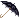
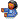
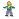

# msnemojis
The Windows Live Messenger emojis
### Keeping a copy of the MSN Live Emojis ### 

## Commands to get the emojis + update the README ran on MacOS## 

#### wget --accept=gif,png,jpg -r -l 1 -nd "https://web.archive.org/web/20140204231459/http://messenger.msn.com/Resource/Emoticons.aspx" 
#### ls -l | awk '{ print "![image]""("$9")"} ' >> out.readmne
